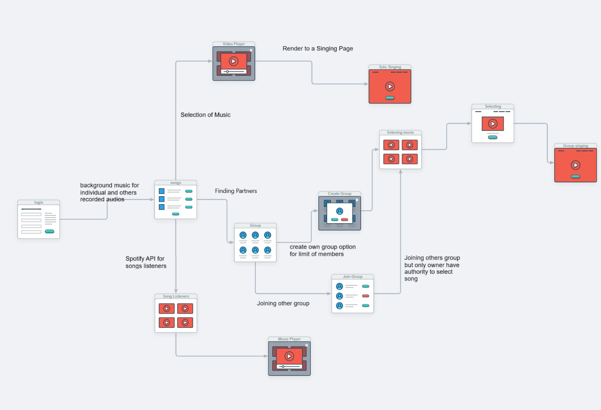

# Sing Together: A Real-Time Music Collaboration Platform (In Progress)

## Wireframe

Below is the initial wireframe for the Sing Together platform, outlining the main user interface elements and layout. This wireframe serves as a visual guide for the ongoing development of the application.

## About the Project

### Real-Time Collaboration
Developing features for real-time music collaboration, enabling users to sing and hear each other instantly. This feature aims to create a seamless and interactive musical experience for users, allowing them to collaborate in real-time from different locations.

### Group and Solo Singing
Users can sing in groups or solo and create a group, becoming the owner of the group. Other users can join as members. The group owner can customize or add the type of song, which will be mentioned as the title, and set the number of joiners in the group. The owner can select or play the song.

### Recording Functionality
Implementing an on-screen lyrics and music feature for recording performances. This functionality enhances user engagement by providing tools to capture and review their singing sessions, promoting continuous improvement and enjoyment.

### Social Interaction
Integrating video chat for interactive singing sessions. This feature boosts user interaction and community building by allowing users to see and communicate with each other in real-time, fostering a sense of connection and collaboration.

### Enhanced User Experience
Adding chat functionality and dynamic audio visualizations. These enhancements aim to enrich the overall user experience by providing additional ways to interact and visualize the music, making the platform more engaging and enjoyable.

## Current Status
This project is currently in progress, and the features mentioned above are under active development. Stay tuned for updates and feel free to check back regularly for the latest additions and improvements.

## How to Contribute
If you're interested in contributing to this project, please fork the repository and submit pull requests. Your contributions and feedback are highly appreciated!

## Contact
For any questions or suggestions, please open an issue or contact me at [amanwaikar13@gmail.com](mailto:amanwaikar13@gmail.com).
